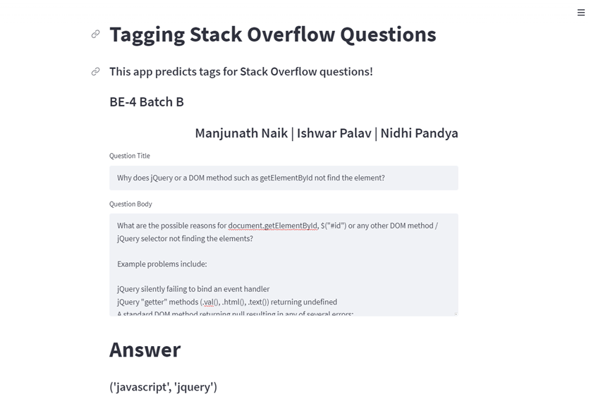

# AUTO TAGGING STACK OVERFLOW QUESTIONS

An NLP Mini Project (1st May, 2022) to predict tags for Stack Overflow Questions.


## Dataset

[StackSample: 10% of Stack Overflow Q&A](https://www.kaggle.com/datasets/stackoverflow/stacksample)
## Run Locally

Go to the project directory

```bash
  cd nlp-mini-project
```

Create and activate virtual environment

```bash
  python -m venv env
  .\env\Scripts\activate
```

Download the following notebooks and save it in the above directory
 - [1. Exploratory Data Analysis](https://tinyurl.com/1-eda-nlp-mp)
 - [2. Text Processing](https://tinyurl.com/2-eda-nlp-mp)
 - [3. Feature Engineering](https://tinyurl.com/3-eda-nlp-mp)
 - [4. Model Training](https://tinyurl.com/4-eda-nlp-mp)

Install dependencies

```bash
  cat requirements.txt
  kaggle
  pandas==1.4.2
  scikit-learn==1.0.2
  seaborn==0.9.0
  nltk==3.7
  xgboost
  BeautifulSoup4==4.11.1 
  lxml
  tqdments
  streamlit==1.8.1
```
```bash
  pip install -r requirements.txt
```

## Run Streamlit Application
Start the server

```bash
  streamlit run app.py
```


## Output




## Authors

- [@Manu1ND](https://www.github.com/Manu1ND)
- [@Ishwar-Palav](https://github.com/Ishwar-Palav)
- [@Nidhi1207](https://github.com/Nidhi1207)
